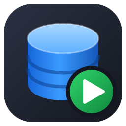
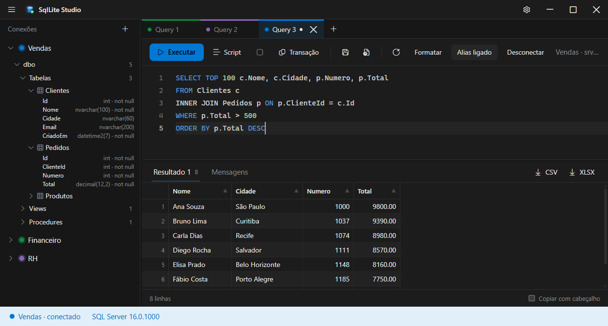

<p align="center"></p>

# SqlLite Studio

Cliente desktop leve para consultar bancos **SQL Server**, só para Windows. Interface moderna em tema escuro, execução no estilo do DBeaver e travas contra comandos destrutivos.



## Funcionalidades

- **Várias conexões ao mesmo tempo**, com autenticação SQL, cada uma com a sua cor. A senha é guardada criptografada (DPAPI) e nunca volta para a interface.
- **Abas de query coloridas** pela conexão, com restauração das abas ao reabrir o app.
- **Editor Monaco** com autocomplete contextual (tabelas, colunas, schemas, procedures) e alias automático de tabela.
- **Formatação do SQL** (`Shift+Alt+F` ou botão Formatar): da seleção ou do texto todo, preservando comentários e textos entre aspas, e só aceita o resultado se o conteúdo do script não mudar.
- **Execução como no DBeaver:** `Ctrl+Enter` executa a seleção ou o statement sob o cursor, `Ctrl+\` abre o resultado numa nova sub-aba, `F5` executa o script inteiro (com `GO`) e `Esc` cancela.
- **Resultados** em grade virtualizada: ordenação pela setinha do cabeçalho, clique no título para selecionar a coluna inteira, colunas redimensionáveis e reordenáveis, cópia para o Excel, vários result sets e aba de mensagens.
- **Travas de segurança:** `UPDATE` e `DELETE` sem `WHERE`, `TRUNCATE` e `DROP` exigem dupla confirmação; o comando roda dentro de uma transação, mostra o antes e o depois, e só então você escolhe Commit ou Rollback.
- **Transações:** recomendação de `TRANSACTION` para comandos de escrita, indicador de transação aberta nas abas e decisão ao fechar a aba ou o app.
- **Exportação** em CSV e XLSX, em streaming, respeitando a ordenação atual; resultados grandes podem ser reexecutados e exportados por inteiro.
- **Árvore de objetos** com schemas, tabelas, views e procedures; cada tabela e view expande para mostrar os **campos**, com o tipo e se aceitam NULL. Duplo clique abre um `SELECT TOP 100` da tabela.

## Como executar

**Requisitos:** Windows 10 ou 11, [.NET 8 SDK](https://dotnet.microsoft.com/download/dotnet/8.0), [Node.js](https://nodejs.org) (versão LTS) e o [WebView2 Runtime](https://developer.microsoft.com/microsoft-edge/webview2/) (já vem no Windows 10 e 11).

**Em desenvolvimento** (dois terminais, na raiz do repositório):

```powershell
# 1. frontend (Vite)
cd src/SqlDesk.Web
npm install
npm run dev

# 2. aplicativo
dotnet run --project src/SqlDesk.Host
```

**Gerar o executável único:**

```powershell
dotnet publish src/SqlDesk.Host -c Release -o publish
```

O resultado é um único `publish/SqlDesk.exe`, que já leva o runtime e o frontend embutidos.

**Testes:**

```powershell
dotnet test
cd src/SqlDesk.Web; npm test
```

## Estrutura

| Pasta | Conteúdo |
| --- | --- |
| `src/SqlDesk.Host` | Janela WPF com WebView2 e ponte de mensagens |
| `src/SqlDesk.Core` | Conexões, execução, metadados, transações e exportação |
| `src/SqlDesk.SqlAnalysis` | Análise de T-SQL (ScriptDom): statements, travas e reescrita com `OUTPUT` |
| `src/SqlDesk.Web` | Frontend React, Vite e Monaco |
| `tests` | Testes de Core e SqlAnalysis |

Os dados do usuário (conexões e sessão) ficam em `%APPDATA%\SqlDesk`. Decisões de projeto e limitações estão em [`docs/decisoes.md`](docs/decisoes.md).
